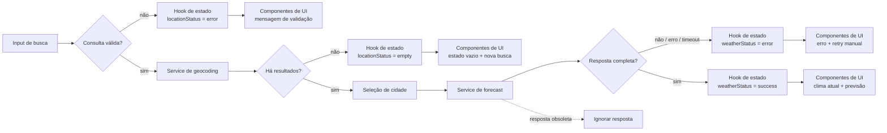

# Plano Técnico — Weather App

## Architecture

### Visão geral

A aplicação será uma SPA React + TypeScript com uma única tela principal. O fluxo será dividido em quatro camadas simples:

```text
UI components
    ↓ eventos e props
useWeather / estado da tela
    ↓ chamadas de domínio
services/openMeteo
    ↓ normalização e validação
Open-Meteo APIs
```

- **UI:** formulário de busca, resultados de localidades, clima atual, previsão, seletor de unidade e estados de carregamento/erro/vazio.
- **Orquestração:** um hook ou controlador de tela coordena busca, seleção, consulta meteorológica, unidade e descarte de respostas obsoletas.
- **Domínio:** funções puras convertem unidades, formatam datas e traduzem códigos meteorológicos.
- **Integração:** um serviço isolado conhece URLs, parâmetros, timeout e formato da Open-Meteo.

### Limites entre camadas

- `components` pode importar tipos e funções de `lib`, mas não acessa `fetch`, URLs ou respostas brutas da API.
- `hooks` pode chamar `services` e `lib`, mas não contém marcação visual nem regras de apresentação específicas de um componente.
- `services` pode importar tipos e funções de normalização, mas não depende de React, hooks ou componentes.
- `lib` não conhece React, rede ou estado global; recebe valores e devolve resultados determinísticos.
- `types` não contém comportamento nem dependências de infraestrutura.

Essa direção deixa a UI substituível, concentra efeitos colaterais em `services` e torna as regras críticas testáveis sem navegador ou rede.

### Decisões arquiteturais

- Uma cidade por vez, conforme `RF-02`, `RF-03` e `RF-06`.
- Temperaturas são mantidas em Celsius no domínio; Fahrenheit é uma transformação de apresentação (`RF-04`).
- O resultado anterior é substituído por loading ao iniciar nova consulta (`RF-05`).
- A resposta só pode atualizar a tela se corresponder à consulta mais recente (`RF-06`, `RNF-05`).
- Não haverá store global, cache persistente, autenticação ou camada de backend no MVP (`Out of Scope`).

Os sete requisitos funcionais estão cobertos pelo fluxo e pelos contratos; os requisitos de responsividade, acessibilidade, desempenho, timeout, confiabilidade, compatibilidade, privacidade e atualização são verificados na estratégia de testes e nos critérios de qualidade.

### Testabilidade da arquitetura

- Componentes recebem props e callbacks, permitindo testes de renderização e interação com Testing Library.
- `useWeather` pode ser testado com serviços mockados para verificar transições `idle → loading → success/empty/error`, retry manual e descarte de respostas obsoletas.
- `services` recebe um cliente HTTP substituível ou mockável, permitindo testar timeout, status HTTP e payloads inválidos sem chamar a Open-Meteo.
- `lib` é coberta por testes unitários puros para conversão, validação, datas e códigos WMO.
- Playwright valida somente a composição real e os fluxos principais, reduzindo dependência de testes E2E para regras que já têm testes unitários.

## Tech Stack

| Tecnologia | Uso | Justificativa |
| --- | --- | --- |
| TypeScript strict | Domínio, serviços e UI | Contratos explícitos para respostas externas e estados da tela. |
| React | Componentes e composição da tela | Stack definida pelo projeto e adequada ao fluxo interativo. |
| Vite | Desenvolvimento e build | Ferramenta já adotada pelo repositório. |
| Tailwind CSS | Layout e responsividade | Convenção existente e suporte direto ao viewport mínimo de 320 px. |
| Fetch API | Requisições HTTP | Dependência nativa suficiente para dois endpoints simples. |
| Vitest + Testing Library | Testes unitários e de componentes | Cobertura de funções puras, estados e acessibilidade básica. |
| Playwright | Testes E2E | Validação da jornada principal em viewport e navegadores suportados. |
| Biome | Lint e formatação | Ferramenta definida pelo projeto. |
| pnpm | Dependências e scripts | Gerenciador definido pelo projeto. |

Não será introduzida biblioteca de gerenciamento de estado, cliente HTTP ou cache enquanto o fluxo couber no hook de domínio e nos serviços existentes.

## Project Structure

```text
src/
├── components/
│   ├── SearchForm.tsx
│   ├── LocationResults.tsx
│   ├── CurrentWeather.tsx
│   ├── ForecastList.tsx
│   ├── TemperatureUnitToggle.tsx
│   └── states/
│       ├── LoadingState.tsx
│       ├── EmptyState.tsx
│       └── ErrorState.tsx
├── hooks/
│   └── useWeather.ts
├── services/
│   ├── openMeteo.ts
│   └── http.ts
├── lib/
│   ├── temperature.ts
│   ├── weatherCodes.ts
│   ├── dateTime.ts
│   └── validation.ts
├── types/
│   ├── weather.ts
│   └── openMeteo.ts
├── styles/
│   └── globals.css
├── App.tsx
└── main.tsx
```

- `components/` recebe dados prontos para apresentação e emite eventos de usuário.
- `components/SearchForm.tsx` valida interação básica do formulário e encaminha uma consulta ao hook; não chama a API.
- `components/LocationResults.tsx` apresenta até cinco `City` e emite a localidade selecionada.
- `components/CurrentWeather.tsx` apresenta `CurrentWeather` e unidade formatada.
- `components/ForecastList.tsx` apresenta os cinco `ForecastDay` em ordem.
- `components/TemperatureUnitToggle.tsx` alterna `Unit` por callback, sem disparar rede.
- `components/states/` contém estados visuais reutilizáveis para loading, vazio e erro.
- `hooks/useWeather.ts` mantém `WeatherState`, coordena eventos, controla identificadores de consulta e chama os serviços.
- `services/openMeteo.ts` expõe operações de domínio para geocoding e forecast; converte DTOs externos em tipos internos.
- `services/http.ts` centraliza timeout e tratamento básico de respostas HTTP, sem conhecer componentes.
- `lib/temperature.ts` converte e formata Celsius/Fahrenheit.
- `lib/weatherCodes.ts` mapeia códigos WMO para descrições pt-BR.
- `lib/dateTime.ts` formata datas no fuso da cidade.
- `lib/validation.ts` valida consulta, payloads e os cinco dias obrigatórios.
- `types/weather.ts` contém `City`, `CurrentWeather`, `ForecastDay`, `WeatherData`, `Unit` e estados do domínio.
- `types/openMeteo.ts` contém somente os contratos mínimos das respostas externas.
- `styles/` contém estilos globais e tokens visuais, sem lógica de negócio.
- `App.tsx` compõe a tela e conecta eventos do usuário ao hook.
- `main.tsx` inicializa a aplicação.

Cada pasta tem uma responsabilidade verificável: uma alteração em formato ou layout fica em `components/styles`, uma alteração de regra pura fica em `lib`, uma alteração de integração fica em `services` e uma alteração de fluxo fica em `hooks`.

## Data Model

Os contratos abaixo descrevem o domínio; não representam código final.

### Tipos de domínio

```ts
type Unit = 'celsius' | 'fahrenheit'

interface City {
  /** Identificador da localidade no geocoding. */
  id: number

  /** Nome da cidade. */
  name: string

  /** Estado ou região administrativa. */
  region?: string

  /** Nome do país. */
  country?: string

  /** Código ISO do país. */
  countryCode?: string

  /** Latitude da localidade. */
  latitude: number

  /** Longitude da localidade. */
  longitude: number

  /** Fuso horário retornado pelo geocoding. */
  timezone?: string

  /** Elevação em metros, quando disponível. */
  elevation?: number
}

interface CurrentWeather {
  /** Temperatura atual em Celsius no modelo interno. */
  temperatureCelsius: number

  /** Código WMO do estado meteorológico. */
  weatherCode: number

  /** Descrição do código WMO em pt-BR. */
  description: string

  /** Data e hora do dado no fuso da cidade. */
  observedAt?: string

  /** Indica se é dia; deriva de is_day 1 (true) ou 0 (false) da API. */
  isDay?: boolean
}

interface ForecastDay {
  /** Data local da cidade no formato ISO YYYY-MM-DD. */
  date: string

  /** Código WMO predominante do dia. */
  weatherCode: number

  /** Descrição do estado do tempo em pt-BR. */
  description: string

  /** Temperatura mínima em Celsius. */
  minimumCelsius: number

  /** Temperatura máxima em Celsius. */
  maximumCelsius: number
}

interface WeatherData {
  /** Cidade selecionada pela pessoa. */
  city: City

  /** Condições meteorológicas atuais. */
  current: CurrentWeather

  /** Previsão de hoje e dos quatro dias seguintes. */
  forecast: ForecastDay[]

  /** Fuso horário usado para datas e horários. */
  timezone: string

}
```

O contrato de estado da tela e a classificação de erros são definidos na seção **State Management**, para manter uma única fonte de verdade para as transições.

### Regras de domínio

- `locations` contém no máximo cinco itens (`RF-01`).
- `forecast` contém exatamente cinco itens, hoje mais quatro dias, no fuso da cidade (`RF-03`).
- Temperaturas internas são Celsius; conversão para Fahrenheit ocorre somente na apresentação (`RF-04`).
- Um `WeatherData` só é válido quando todos os campos mínimos estão presentes (`RF-05`, `CA-10`).
- Códigos meteorológicos são convertidos para descrições pt-BR por uma tabela pura; código desconhecido invalida o relatório ou produz erro de dados, nunca uma descrição vazia.

## Data Flow



### Busca de cidade

1. A pessoa digita no `SearchForm`.
2. O formulário remove espaços nas extremidades e valida 1–100 caracteres e presença de caractere alfanumérico.
3. Entrada inválida atualiza `locationStatus = error` sem requisição.
4. Entrada válida incrementa o identificador de consulta, limpa o contexto anterior e define `locationStatus = loading`.
5. `useWeather` chama `searchCities` no serviço.
6. O serviço converte a resposta em `City[]`, limita a cinco localidades e valida campos necessários.
7. A UI mostra resultados, estado vazio ou erro.

### Seleção e previsão

1. A pessoa seleciona um `City` em `LocationResults`.
2. O hook salva `selectedCity`, limpa `weatherData` e define `weatherStatus = loading`.
3. O serviço chama o endpoint de forecast com latitude, longitude, cinco dias e timezone automático da localidade.
4. A resposta externa é validada e normalizada para `WeatherData`.
5. O hook descarta a resposta se seu identificador não for o mais recente.
6. Em sucesso, a UI recebe clima atual e cinco dias; em falha, recebe `WeatherError` recuperável.

### Alternância de unidade

1. `TemperatureUnitToggle` altera `unit` entre `celsius` e `fahrenheit`.
2. Componentes formatam os valores Celsius de `WeatherData` conforme a unidade.
3. Nenhuma chamada de rede é feita (`CA-06`).
4. Ao criar o estado inicial de uma nova sessão, `unit = 'celsius'` (`CA-07`).

## External APIs

### Geocoding Open-Meteo

- **Método e URL:** `GET https://geocoding-api.open-meteo.com/v1/search`
- **Parâmetros relevantes:**
  - `name`: consulta normalizada, com 1 a 100 caracteres.
  - `count=5`: limita a resposta aos cinco resultados usados pelo produto.
  - `language=pt`: solicita nomes localizados quando disponíveis.
  - `format=json`: solicita resposta JSON.
- **Exemplo de requisição:**

  `https://geocoding-api.open-meteo.com/v1/search?name=Sao%20Paulo&count=5&language=pt&format=json`

- **Exemplo resumido de resposta:**

  ```json
  {
    "results": [
      {
        "id": 3448439,
        "name": "São Paulo",
        "latitude": -23.55,
        "longitude": -46.63,
        "elevation": 760,
        "feature_code": "PPLA",
        "country_code": "BR",
        "admin1": "São Paulo",
        "country": "Brasil",
        "timezone": "America/Sao_Paulo"
      }
    ],
    "generationtime_ms": 0.2
  }
  ```

- **Mapeamento para `City`:** `id` → `id`; `name` → `name`; `admin1` → `region`; `country` → `country`; `country_code` → `countryCode`; `latitude`/`longitude` → coordenadas; `timezone` → `timezone`; `elevation` → `elevation`.
- **Sem resultados:** `results` ausente ou vazio produz estado `empty`; não chamar forecast (`CA-09`).
- **Resposta inválida ou erro:** produzir `WeatherError` do tipo `api` ou `invalid-data`.

### Forecast Open-Meteo

- **Método e URL:** `GET https://api.open-meteo.com/v1/forecast`
- **Parâmetros relevantes:**
  - `latitude` e `longitude`: coordenadas da `City` selecionada.
  - `current=temperature_2m,weather_code,is_day`: clima atual, código WMO e indicador dia/noite.
  - `daily=weather_code,temperature_2m_min,temperature_2m_max`: dados mínimos de cada dia.
  - `forecast_days=5`: hoje e os quatro dias seguintes.
  - `timezone=auto`: datas e horários no fuso da coordenada consultada.
  - `temperature_unit=celsius`: mantém Celsius no modelo interno.
- **Exemplo de requisição:**

  `https://api.open-meteo.com/v1/forecast?latitude=-23.55&longitude=-46.63&current=temperature_2m,weather_code,is_day&daily=weather_code,temperature_2m_min,temperature_2m_max&forecast_days=5&timezone=auto&temperature_unit=celsius`

- **Exemplo resumido de resposta:**

  ```json
  {
    "latitude": -23.55,
    "longitude": -46.63,
    "timezone": "America/Sao_Paulo",
    "current_units": { "temperature_2m": "°C" },
    "current": {
      "time": "2026-09-30T14:00",
      "temperature_2m": 22.4,
      "weather_code": 2,
      "is_day": 1
    },
    "daily": {
      "time": ["2026-09-30", "2026-10-01", "2026-10-02", "2026-10-03", "2026-10-04"],
      "weather_code": [2, 61, 3, 1, 0],
      "temperature_2m_min": [17.2, 18.0, 16.5, 17.1, 16.8],
      "temperature_2m_max": [25.4, 23.1, 24.0, 26.2, 27.0]
    }
  }
  ```

- **Mapeamento para `CurrentWeather`:** `current.temperature_2m` → `temperatureCelsius`; `current.weather_code` → `weatherCode`; descrição pt-BR → `description` por tabela WMO; `current.time` → `observedAt`; `current.is_day === 1` → `isDay: true` e `current.is_day === 0` → `isDay: false`.
- **Mapeamento para `ForecastDay`:** índice `i` de `daily.time[i]` → `date`; `daily.weather_code[i]` → `weatherCode`; descrição WMO → `description`; `daily.temperature_2m_min[i]` → `minimumCelsius`; `daily.temperature_2m_max[i]` → `maximumCelsius`.
- **Mapeamento para `WeatherData`:** `City` selecionada → `city`; objeto `CurrentWeather` → `current`; cinco objetos `ForecastDay` → `forecast`; `timezone` da resposta → `timezone`. A unidade não pertence ao dado meteorológico e permanece somente em `WeatherState.unit`.
- **Validação:** `current`, `daily` e todos os arrays diários devem existir; os arrays devem conter exatamente cinco itens e os campos mínimos devem ser numéricos/não vazios.
- **Resposta parcial:** rejeitar o relatório completo e retornar erro `invalid-data` (`CA-10`).

### Política HTTP

- Toda chamada usa timeout de 10 segundos.
- Apenas respostas HTTP de sucesso com JSON válido são aceitas.
- Nenhuma chave ou credencial é enviada.
- O serviço não expõe detalhes técnicos de erro para a UI; converte falhas em `WeatherError`.

## State Management

### Local do estado

- O estado vive no hook `useWeather`, próximo à tela `App`.
- `App` compõe os componentes e passa estado e callbacks; componentes não criam cópias dos dados meteorológicos.
- Não haverá store global, contexto de estado ou persistência no MVP: existe uma única cidade ativa e uma única tela de consulta.
- A unidade não é persistida em `localStorage` ou servidor.

### Estado explícito

```ts
type AsyncStatus = 'idle' | 'loading' | 'success' | 'error' | 'empty'

interface WeatherState {
  searchQuery: string
  locations: City[]
  selectedCity?: City
  weatherData?: WeatherData
  unit: Unit
  locationStatus: AsyncStatus
  weatherStatus: AsyncStatus
  error?: WeatherError
  requestId: number
}
```

- `idle`: nenhuma operação correspondente foi executada; estado inicial sem cidade, resultados ou clima.
- `loading`: há uma operação em andamento; o resultado anterior não é exibido como atual.
- `success`: a operação terminou e os dados mínimos são válidos.
- `empty`: a operação terminou sem resultado, aplicável principalmente ao geocoding.
- `error`: a operação falhou ou retornou dados inválidos; a mensagem e a recuperação ficam disponíveis.

`locationStatus` controla a busca de cidades. `weatherStatus` controla a consulta do clima e da previsão. Os dois status são independentes para que um erro de geocoding não seja confundido com um erro meteorológico.

### Transições principais

| Evento | Atualização de estado |
| --- | --- |
| Abrir aplicação | `locationStatus = idle`, `weatherStatus = idle`, sem `selectedCity` ou `weatherData`. |
| Enviar consulta inválida | `locationStatus = error`, sem requisição. |
| Enviar consulta válida | Incrementar `requestId`, limpar localidades, cidade e clima; `locationStatus = loading`. |
| Geocoding com resultados | Salvar até cinco `locations`; `locationStatus = success`. |
| Geocoding sem resultados | Limpar `locations`; `locationStatus = empty`. |
| Selecionar cidade | Salvar `selectedCity`, limpar `weatherData`; `weatherStatus = loading`. |
| Forecast válido | Salvar `weatherData`; `weatherStatus = success`. |
| Forecast vazio/parcial ou falha | Limpar `weatherData`; `weatherStatus = error`. |
| Nova busca ou retry | Iniciar somente a operação solicitada manualmente. |

Cada requisição recebe o `requestId` vigente. Uma resposta só pode alterar o estado se seu identificador ainda for o mais recente; respostas obsoletas são ignoradas.

### Conversão de unidade

- `WeatherData.current.temperatureCelsius`, `ForecastDay.minimumCelsius` e `ForecastDay.maximumCelsius` permanecem sempre em Celsius.
- `unit` é somente uma preferência de apresentação em memória, iniciada como `'celsius'`.
- A renderização chama funções puras equivalentes a `toFahrenheit(celsius)` e `formatTemperature(celsius, unit)`.
- A fórmula de Fahrenheit é `$F = C \times 9 / 5 + 32$`; o arredondamento e o símbolo da unidade ficam centralizados no formatador.
- Alternar `unit` recalcula os textos derivados em memória, não altera `WeatherData` e não dispara request (`CA-06`).

## Error Handling

### Classificação de erros

```ts
type WeatherErrorKind =
  | 'invalid-input'
  | 'network'
  | 'api'
  | 'timeout'
  | 'invalid-data'

interface WeatherError {
  kind: WeatherErrorKind
  message: string
  retryable: boolean
}
```

- **Entrada inválida:** erro local de validação; não faz request e orienta a correção.
- **Rede:** falha de conexão, DNS ou `fetch`; mantém a UI utilizável e permite retry manual.
- **API:** status HTTP não sucedido ou erro declarado pela Open-Meteo; não expõe detalhes técnicos e permite retry manual.
- **Timeout:** nenhuma resposta válida em 10 segundos; encerra o loading e permite retry manual.
- **Resposta parcial/inválida:** JSON válido, mas sem campos mínimos, arrays com tamanho diferente de cinco ou códigos sem descrição; rejeita o relatório e permite retry/manual nova busca.

### Estados e mensagens

| Situação | Estado | Mensagem/ação esperada |
| --- | --- | --- |
| Tela recém-aberta | `idle` | Exibir formulário sem clima ou previsão. |
| Consulta em andamento | `loading` | Exibir indicador; ocultar resultado anterior. |
| Entrada inválida | `error` | Informar correção; não fazer requisição. |
| Geocoding sem resultados | `empty` | Informar que nenhuma cidade foi encontrada; permitir nova busca. |
| Forecast sem campos mínimos | `error` | Informar dados incompletos; permitir retry manual. |
| Rede/API indisponível | `error` | Informar indisponibilidade; permitir retry ou nova busca. |
| Timeout | `error` | Informar tempo excedido após 10 segundos; permitir retry manual. |
| Consulta antiga responde depois | Estado da consulta atual | Ignorar resposta obsoleta. |

### Regras

- Não usar dados parciais, antigos ou de outra cidade como resultado atual.
- Não repetir automaticamente falhas; retry só ocorre por ação explícita da pessoa.
- Manter busca, seleção e controles de unidade utilizáveis após qualquer erro recuperável.
- Mensagens visíveis devem estar em pt-BR, ser acionáveis e anunciar loading/erro a tecnologias assistivas (`RNF-02`).
- O serviço converte detalhes técnicos, JSON de erro e stack traces em `WeatherError`; esses detalhes não chegam à UI.
- O botão de retry repete a operação correspondente usando os parâmetros atuais; se nenhuma cidade estiver selecionada, oferece nova busca.
- Erro de geocoding não deve iniciar forecast; erro de forecast não deve alterar a lista de localidades.

## Testing Strategy

### Vitest: funções puras

Cobrir sem React e sem rede:

- validação e normalização de consultas: vazio, limite de 100 caracteres, acentos, hífens e entrada sem alfanuméricos (`CA-02`, `CA-03`, `CA-13`);
- conversão Celsius/Fahrenheit, arredondamento da apresentação, zero e valores negativos (`RF-04`);
- mapeamento de todos os códigos WMO suportados para descrições pt-BR e comportamento para código desconhecido;
- formatação de datas e horários usando o fuso da cidade (`CA-14`);
- derivação de valores exibidos sem mutar `WeatherData` e sem disparar efeitos colaterais.

### Vitest: services com `fetch` mockado

Substituir `fetch` por mock controlado e verificar request, parsing e classificação de erro:

- geocoding com consulta válida, até cinco resultados e resposta vazia (`CA-01`, `CA-09`);
- forecast com resposta completa de cinco dias e mapeamento para `WeatherData` (`CA-04`, `CA-05`);
- parâmetros obrigatórios: `current`, `daily`, `forecast_days=5`, `timezone=auto` e Celsius;
- status HTTP de erro, JSON inválido, erro declarado pela API e falha de rede;
- timeout em 10 segundos, sem retry automático (`CA-11`, `CA-17`);
- resposta parcial, arrays com tamanho diferente de cinco, campos ausentes e códigos inválidos (`CA-10`);
- duas respostas concorrentes, confirmando que a resposta obsoleta não atualiza o estado (`CA-16`, `RNF-05`).

### Vitest + Testing Library: componentes

Renderizar componentes com dados e callbacks controlados:

- formulário bloqueia entrada inválida e envia consulta válida;
- resultados mostram no máximo cinco localidades e dados de desambiguação;
- estado `loading` mostra indicador e não exibe o resultado anterior;
- estado `empty` informa ausência de cidades e mantém nova busca disponível;
- estado `error` informa o problema e oferece retry ou nova busca;
- estado `success` exibe cidade, clima atual e exatamente cinco dias;
- seleção mostra clima atual e cinco dias;
- alternância de unidade atualiza Celsius/Fahrenheit sem nova requisição nem mutação dos dados;
- controles têm nomes acessíveis, foco visível e suporte a teclado (`RNF-02`).

### Playwright: fluxos E2E

Usar respostas de rede controladas para que os testes sejam determinísticos:

- jornada principal: abrir, buscar, selecionar e visualizar clima/previsão (`US-01` a `US-04`);
- cidade inexistente e input inválido;
- falha de API, timeout, resposta parcial e retry manual (`US-06`, `US-07`);
- nova busca substitui dados e respostas antigas são ignoradas;
- Celsius/Fahrenheit sem nova chamada;
- viewport mobile de 320 px sem overflow horizontal e viewport desktop com conteúdo legível;
- jornada por teclado e verificação de estados acessíveis;
- matriz das duas versões estáveis mais recentes de Chrome, Edge, Firefox e Safari, incluindo mobile quando suportado pelo ambiente.

### Critérios de qualidade

- Cada requisito `RF-*` deve ter pelo menos um teste automatizado ligado a um `CA-*`.
- Testes de rede não devem depender da disponibilidade real da Open-Meteo; respostas externas devem ser simuladas nos testes.
- A meta de desempenho será verificada com pelo menos 20 consultas controladas; pelo menos 19 devem concluir em até três segundos (`RNF-04`).
- O mock de `fetch` deve afirmar URL, método e parâmetros, não apenas o resultado visual.
- Testes de componentes devem cobrir explicitamente `loading`, `empty`, `error` e `success`.
- Playwright deve cobrir pelo menos uma jornada em viewport de 320 px e uma em viewport desktop.
- Antes de concluir, executar `pnpm lint`, `pnpm build`, `pnpm test` e, quando o ambiente estiver disponível, `pnpm test:e2e`.

## Risks & Trade-offs

| Decisão/risco | Escolha | Trade-off e mitigação |
| --- | --- | --- |
| Estado local versus store global | Hook único de tela | Menos dependências e complexidade; adequado a uma cidade por vez. |
| Celsius interno versus unidade da API | API em Celsius, conversão na apresentação | Evita nova requisição e mantém consistência entre atual e previsão; exige teste de conversão. |
| Resposta parcial | Rejeitar relatório inteiro | Evita dados enganosos; reduz informação exibida quando apenas parte está disponível. |
| Retry | Manual, sem repetição automática | Evita duplicar chamadas e atingir limites da API; exige ação explícita do usuário. |
| Cache/offline | Fora do MVP | Simplifica privacidade e consistência; sem dados disponíveis sem rede. |
| Dependência externa | Open-Meteo sem chave | Reduz configuração e risco de credencial; disponibilidade e formato estão fora do controle do app. |
| Cinco resultados | Limite fixo | Mantém seleção legível em mobile; pode ocultar resultados menos relevantes. |
| Data no fuso da cidade | `timezone=auto` | Evita datas incorretas para localidades distantes; exige validação de timezone e formatação. |
| Sem atualização automática | Nova busca manual | Reduz requisições e comportamento inesperado; dados podem ficar desatualizados durante uma sessão longa. |

### Alternativas consideradas

- **Store global (Redux/Zustand) versus hook local:** store global facilitaria compartilhamento entre telas, mas não há múltiplos consumidores no MVP; o hook reduz boilerplate e superfície de teste.
- **MSW versus mock direto de `fetch`:** MSW aproxima o comportamento HTTP real, mas o mock direto é suficiente para dois endpoints e deixa URL/parâmetros explícitos nos testes unitários; Playwright cobre a integração de rede controlada.
- **Cliente HTTP dedicado versus Fetch API:** um cliente dedicado poderia padronizar interceptors e retry, mas adicionaria dependência sem necessidade para o escopo; `fetch` com um wrapper pequeno cobre timeout e status.
- **Retry automático versus manual:** automático melhora recuperação em redes instáveis, mas pode duplicar requisições e ocultar falhas; manual é mais previsível e está definido na spec.
- **Exibir resposta parcial versus rejeitar tudo:** exibir parcialmente aproveita dados disponíveis, mas pode sugerir uma previsão completa; rejeitar preserva consistência dos campos mínimos.
- **Testar a Open-Meteo real versus mocks:** chamadas reais seriam mais próximas da produção, mas tornam os testes lentos e instáveis; mocks determinísticos ficam nos testes e a integração real é validada manualmente.